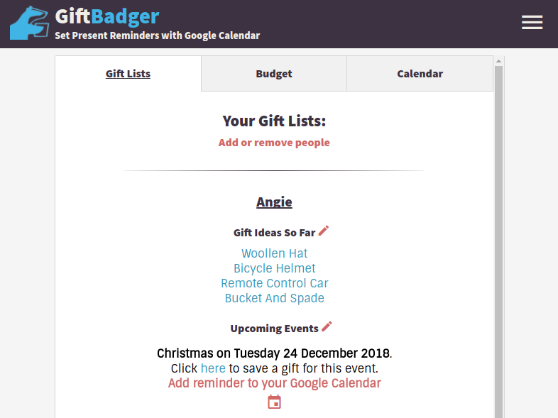
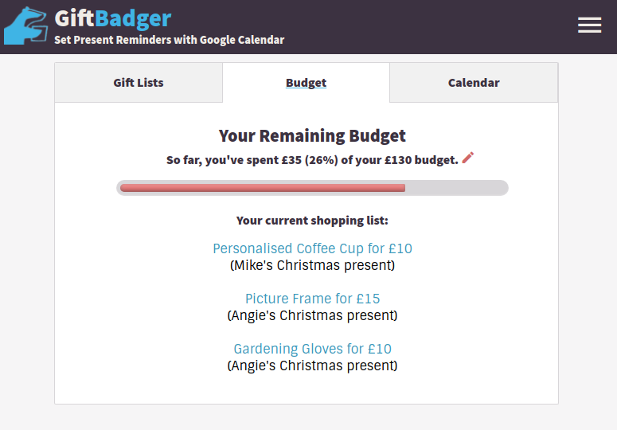
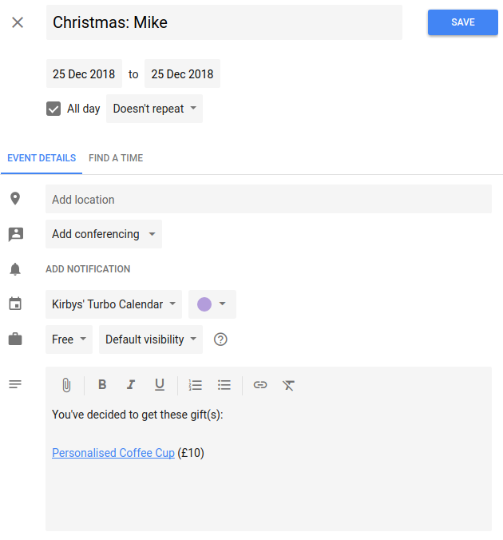

## GiftBadger - Gift-giving Organiser for Google Calendar

Allows users to register with email and create gift lists.  Gifts are automatically assigned Google Shopping search link (unless user provides their own url).  The App populates Google Calendar entries with details about the events - including date, occasion, gifts, recipient and associated urls.  Users are also encouraged to brainstorm gift ideas for each recipient, to be reviewed later.

Created using Node, MongoDb/Mlab, jQuery, Chai/Mocha.

Initial round of user testing (wireframe stage):
https://gist.github.com/rob137/894fb21121893bbe1bb302a0f66d2fb2

Original user flow / wire diagrams:
https://gist.github.com/rob137/7b83392922c57b3ff2958a9ba5ee9704

Original user stories and high-level description:
https://gist.github.com/rob137/b165456ecc23251124b489b2034d77fa

Travis CI: https://travis-ci.org/rob137/GiftBadger

  

  

  

  
  [BrowserStack][http://browserstack.com/] was used for cross-browser testing.